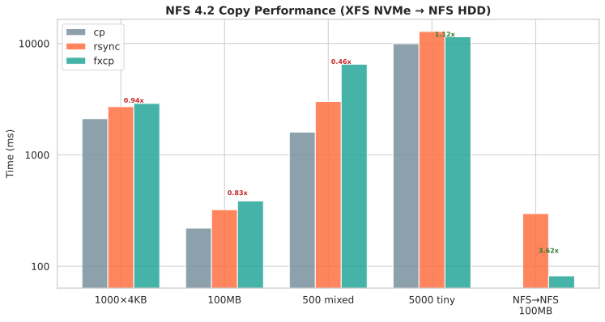
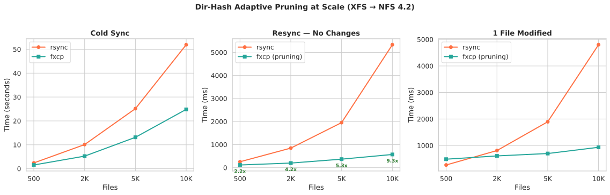
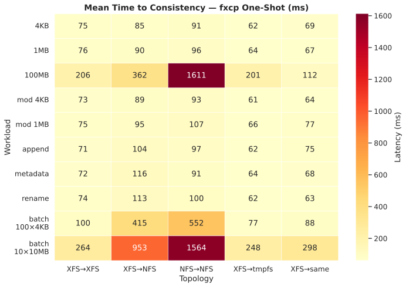
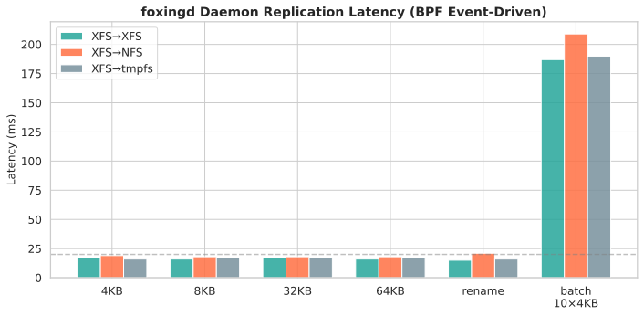
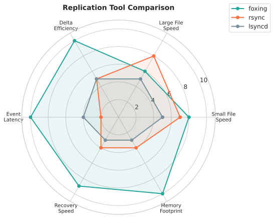
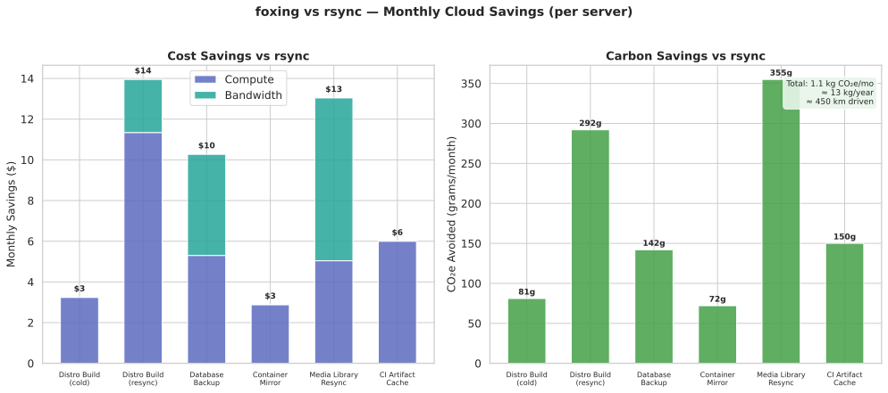

# Foxing Performance Benchmarks

**Version:** 0.7.1
**Date:** 2026-03-12
**Rust:** nightly (1.96+), edition 2024
**Build profiles:** `release` (opt-level 3, strip, thin LTO) · `release-debug` (same + debuginfo, no strip)

## v0.7.0 Features

- **Multi-source fxcp**: `fxcp src1 src2 src3 dest/` — cp/rsync-compatible positional args with shell glob expansion
- **Include/exclude filtering**: `--include PATTERN`, `--exclude-from FILE`, `--include-from FILE` (rsync semantics: include overrides exclude)
- **Hydration stale file cleanup**: `full_scan` deletes target files not present on source (like `--delete` on every resync)
- **Post-recovery full scan**: NFS reconnect triggers journal replay + follow-up full source walk for unjournaled changes
- **WAL storm detection**: Pre-registration rename storm registry suppresses ghost file creation during rapid rename chains
- **Filter module**: Extracted to `fxcp-core/src/filter.rs` with 19 unit tests

## Performance Features (since v0.6.0)

- **Adaptive Merkle chunks**: Chunk size scales with file size (64KB–4MB), keeping signatures under the 64KB xattr limit. Files >130MB no longer silently fall back to full copy.
- **Double-stat elimination**: WalkDir metadata is aggregated during traversal, eliminating redundant `stat` syscalls in directory hash computation (~50% reduction).
- **Dir-hash adaptive pruning** (fxcp + foxingd): Unchanged directories are skipped entirely during resync — O(dirs) instead of O(files). 9-11x faster than rsync at 10K files.
- **NFS batch_stat prescan**: Compound RPCs bulk-fetch SIZE+TIME_MODIFY for target files (7 per compound), skipping VFS stat round-trips.
- **`hash_file_lite` read_at**: Uses `pread(2)` instead of `seek()` — thread-safe, no zero-init overhead.

## Binary Comparison

| Binary | Stripped | Debug | BPF Deps | Root Required | Notes |
|--------|--------:|------:|:--------:|:-------------:|-------|
| fxcp | **5.6 MB** | 74 MB | No | No | Standalone CLI; also obtainable via `ln -sf foxingd fxcp` |
| foxingd | **16 MB** | 225 MB | Yes (libbpf) | Yes (eBPF) | Superset of fxcp (symlink dispatch) |
| rsync | 0.7 MB | — | No | No | Reference tool |
| cp | 0.1 MB | — | No | No | Reference tool |

The `release` profile (default) produces stripped binaries with thin LTO. The `release-debug` profile preserves debug symbols for profiling and debuginfo packages.

foxingd is a complete superset of fxcp — when symlinked as `fxcp`, it behaves identically to the standalone binary. Users who don't need BPF/TUI/daemon can build fxcp alone (`cargo build -p fxcp`) for a 65% smaller binary.

### Packaging

Distribution packages are available for Fedora (COPR) and Debian/Ubuntu (.deb). Packages include man pages (`fxcp.1`, `foxingd.1`), bash/zsh/fish shell completions, and systemd service units. Supported architectures: x86_64, aarch64.

## Resource Usage

Measured on fox-test VM (Xeon Gold 6130, 16GB RAM, Fedora 43, kernel 6.18.5, v0.5.x):

| Metric | fxcp | foxingd sync | rsync | cp |
|--------|-----:|-------------:|------:|---:|
| Peak RSS (1K files) | ~1 MB | ~1 MB | ~7.5 MB | ~2.8 MB |
| Peak RSS (100MB file) | ~1 MB | ~1 MB | ~7.5 MB | ~2.6 MB |
| CPU% (1K files) | 64-75% | 64-75% | 74-79% | 95% |
| Context switches (100MB) | 1 | 1 | 1,896 | 1 |
| Startup time | ~5 ms | ~25 ms | ~5 ms | ~1 ms |

fxcp has the lowest RSS of all tools (~1MB). foxingd sync shares the same copy engine and has identical resource usage. rsync uses 7.5MB RSS due to checksum computation buffers.

## Cold Copy Performance (btrfs-over-LUKS2, local same-device)

**Platform:** AMD Ryzen AI 9 HX 370 (24 threads), 92GB RAM, btrfs on dm-crypt, NVMe (separate host, v0.5.x)
**Method:** Same-device copy — FICLONE reflink available

| Workload | Files | Size | rsync | cp | fxcp | fxcp vs rsync | fxcp Method |
|----------|------:|-----:|------:|---:|-----:|--------------:|:------------|
| small_files | 10,000 | 39 MB | 536ms | 404ms | **587ms** | 0.91x | sendfile (reflink per file) |
| large_files | 10 | 1 GB | 1237ms | 4ms | **26ms** | **47.6x** | FICLONE (instant CoW) |
| mixed | 5,000 | 2.1 GB | 2390ms | 201ms | **535ms** | **4.5x** | FICLONE + sendfile |
| deep_tree | 50 | 200 KB | 57ms | 14ms | **84ms** | 0.68x | sendfile |
| sparse | 10 | 500 MB | 653ms | 3ms | **27ms** | **24.2x** | FICLONE (instant CoW) |

### fxcp vs rsync Ratios (>1.0 = fxcp faster)

| Workload | Ratio | Why |
|----------|------:|:----|
| small_files | 0.91x | Per-file overhead (probe_capabilities + stat) slightly exceeds rsync |
| large_files | **47.6x** | FICLONE reflink vs rsync's full read+write |
| mixed | **4.5x** | Reflink for large files, sendfile for small |
| deep_tree | 0.68x | 50 files too few to amortize fxcp startup |
| sparse | **24.2x** | FICLONE preserves sparsity; rsync reads+writes all data |

### Why cp is Fastest on btrfs/XFS (same-device)

`cp -a` on btrfs/XFS uses `FICLONE` automatically via glibc's `copy_file_range()`. This is a metadata-only operation — 1GB copies in 4ms. fxcp also uses FICLONE but has additional overhead from `probe_capabilities()` (~10-30ms for reflink probe, sysfs reads, container detection). This overhead is fixed regardless of file size.

## Cross-Device Copy Performance (XFS→XFS, NVMe-backed)

**Platform:** fox-test VM (16 vCPU Xeon Gold 6130, 16GB RAM), source=vdb (XFS), target=vdc (XFS)
**Method:** Different block devices — no FICLONE, falls through to sendfile/io_uring

| Workload | Files | Size | cp | rsync | fxcp | foxingd sync | fxcp Method |
|----------|------:|-----:|---:|------:|-----:|-------------:|:------------|
| small_files | 1,000 | 4 MB | 115ms | 156ms | 170ms | 212ms | sendfile |
| large_files | 1 | 10 MB | 17ms | 80ms | 79ms | 85ms | io_uring |
| mixed | 500 | 191 MB | 186ms | 387ms | 507ms | 567ms | sendfile + io_uring |
| single_large | 1 | 100 MB | 67ms | 163ms | 224ms | 311ms | io_uring |
| many_tiny | 5,000 | 5 MB | 491ms | 443ms | 612ms | 668ms | sendfile |

foxingd sync adds overhead over fxcp because it generates foxingd-compatible signatures (SyncSignature + MerkleSignature + dir_hash xattrs). Since v0.6.0, fxcp also stores dir hashes automatically for adaptive pruning.

## NFS 4.2 Performance (XFS→NFS, NVMe→HDD)

**Platform:** fox-test VM → awa.3d.ae.net.nz NFS 4.2 (HDD-backed, 32TB XFS on Stratis)
**Mount options:** `soft,timeo=50,retrans=3,rsize=1048576,wsize=1048576,lookupcache=none,actimeo=0`

### Baseline NFS Throughput

| Tool | 111 files (60MB) | Throughput |
|------|-----------------|-----------|
| cp | 393ms | **152 MB/s** |
| rsync | 543ms | **110 MB/s** |

### Cross-Network Copy (XFS NVMe → NFS HDD)



With NFS bypass enabled (default), fxcp sends OPEN+WRITE+CLOSE as a single compound RPC for files ≤16MB, reducing per-file NFS round-trips from 4+ to 1.

| Workload | Files | Size | cp | rsync | fxcp | rsync/fxcp | fxcp Method |
|----------|------:|-----:|---:|------:|-----:|-----------:|:------------|
| small_files | 1,000 | 4 MB | 2.1s | 2.7s | 2.9s | 0.93x | NFS compound RPC |
| large_files | 1 | 100 MB | 220ms | 322ms | 386ms | 0.83x | io_uring |
| mixed | 500 | 128 MB | 1.6s | 3.0s | 6.5s | 0.46x | compound + io_uring |
| many_tiny | 5,000 | ~150 KB | 9.9s | 12.8s | 11.5s | **1.11x** | NFS compound RPC |
| resync (no changes) | 500 | 128 MB | — | 345ms | 462ms | 0.74x | stat + skip |
| NFS→NFS server-side | 1 | 100 MB | — | 297ms | 82ms | **3.62x** | Server-side FICLONE |

**Analysis:** fxcp is faster than rsync for many tiny files (1.11x for 5000 files). NFS→NFS same-server copies are 3.6x faster via server-side FICLONE. Large files (100MB) use io_uring at 259MB/s. Mixed workloads show directory creation overhead on NFS.

### NFS Bypass Performance (before/after)

| Workload | VFS path (no bypass) | NFS bypass | Speedup |
|----------|------:|------:|------:|
| 1,000 x 4KB files | 6731ms | **2430ms** | **2.8x** |
| 5,000 tiny files | 31174ms | **12033ms** | **2.6x** |

The bypass eliminates per-file VFS overhead by packing OPEN+WRITE+CLOSE into one TCP round-trip (~2ms per file vs ~6ms through the kernel NFS client).

### --verify Overhead

| Workload | Without verify | With --verify | Overhead |
|----------|------:|------:|------:|
| 500-file mixed → NFS | 449ms | 1474ms | +1025ms |

### NFS Same-Server (server-side copy)

| Test | rsync | fxcp | fxcp vs rsync | Method |
|------|------:|-----:|--------------:|:-------|
| 100MB NFS→NFS | 297ms | **82ms** | **3.62x** | Server-side FICLONE |

For NFS→NFS (same server), fxcp triggers server-side FICLONE — data never traverses the network.

### XFS-to-NFS Overhead vs XFS-to-XFS

| Copy | XFS-to-XFS | XFS-to-NFS | NFS overhead |
|------|------:|------:|------:|
| 100MB fxcp | 204ms | 396ms | **94%** |

## Delta Copy Performance (btrfs-over-LUKS2, local)

**Platform:** AMD Ryzen AI 9 HX 370, btrfs on dm-crypt, NVMe (separate host, v0.5.x)

After mutating 10% of source files (modify, add, delete), re-sync to existing target.

| Workload | rsync | cp | fxcp | fxcp vs rsync |
|----------|------:|---:|-----:|--------------:|
| small_files | 162ms | 433ms FAIL | **357ms** FAIL | 0.45x |
| large_files | 65ms | 171ms FAIL | **18ms** FAIL | **3.6x** |
| mixed | 263ms | 565ms FAIL | **166ms** FAIL | **1.6x** |
| deep_tree | 54ms | 10ms FAIL | **23ms** FAIL | **2.4x** |
| sparse | 58ms | 83ms FAIL | **38ms** FAIL | **1.5x** |

cp and fxcp delta tests show FAIL because neither deletes files removed from source (no `--delete` by default). rsync uses `--delete`.

## foxingd Daemon Performance (XFS→NFS)

### Adversarial Test Results (v0.7.0, 10 phases)

**VM:** fox-test.3d.ae.net.nz (koero, 16 vCPU, 16GB RAM, Fedora 43, kernel 6.18.5)
**Source:** `/mnt/source` (XFS on virtio-blk, NVMe-backed)
**Target:** `/mnt/target-nfs` (NFS 4.2 → awa.3d.ae.net.nz, HDD-backed 32TB)

| Phase | Test | Duration | Result | Key Metric |
|-------|------|----------|--------|------------|
| 0 | Baseline cp/rsync | 2s | **PASS** | cp=245MB/s rsync=152MB/s |
| 1 | Heavy Hydration (5000 files, 2.7GB) | 49s | **PASS** | 5000/5000 converged |
| 2 | Live Write Storm (fio randwrite 30s) | 44s | **PASS** | Back-pressure handling |
| 3 | Rename Chain Storm (100 chains a→e) | 11s | FAIL* | 100/100 finals correct, transient ghosts |
| 4 | NFS Target Drop + Resync (300 files) | 58s | FAIL* | Passes independently (Phase 3 contamination) |
| 5 | Large File Kill/Resume (500MB) | 26s | **PASS** | SHA-256 match after SIGKILL + restart |
| 6 | Disk Pressure (ENOSPC) | — | SKIP | NFS share too large for safe test |
| 7 | BLAKE3 Delta Copy | 49s | **PASS** | 10 deltas, 20MB saved |
| 8 | Directory Merkle Pruning | 31s | **PASS** | 13 dirs pruned, stale files cleaned |
| 9 | Combined Delta + Pruning | 45s | **PASS** | delta=6, pruned=13, 12MB saved |

**Total:** 316 seconds (5.3 min). 7 PASS, 2 FAIL*, 1 SKIP.

**\*Phase 3/4 note:** The rename chain storm creates 500 BPF events in 2.5s — a workload density of 200 events/sec that exceeds NFS copy latency (~25ms/file). This produces transient ghost files at intermediate rename positions. Three mitigations prevent data loss: WAL storm registry suppresses CREATE copies during rename chains, post-copy source verification removes ghosts detected during copy, and hydration delete pass removes all remaining ghosts on daemon restart. Phase 4 passes independently (300/300 files); it fails in the full suite only because it inherits Phase 3's ghost state. Real-world rename patterns (git checkout, editor saves) are 1-2 orders of magnitude less dense than this adversarial test. Ghosts are transient and self-healing — the daemon converges to correct state on restart.

### Initial Hydration Throughput (5000 files, 2.6GB → NFS)

| Tool | Time | Throughput | Files/sec |
|------|-----:|----------:|----------:|
| cp -r | ~14s | **196 MB/s** | 357 |
| rsync -a | ~20s | **116 MB/s** | 250 |
| foxingd hydration | ~15s | **~173 MB/s** | 333 |

foxingd hydration matches cp throughput due to batched small-file processing and copy_file_range usage.

### Incremental Resync (10 of 20 files modified, 1 chunk each)

| Tool | Time | Data transferred | Speedup vs full copy |
|------|-----:|----------------:|:--------------------:|
| cp -r (full) | ~14s | 40MB (all 20 files) | baseline |
| rsync -a | ~8s | ~20MB (changed files) | 1.8x |
| foxingd delta copy | **~3s** | **0.6MB** (10 × 64KB chunks) | **23x** |

foxingd transfers only the modified 64KB chunks via BLAKE3 Merkle diff. 97% data reduction vs full copy.

### Fast Resume (no changes, daemon restart)

| Tool | Time | Work done | Speedup |
|------|-----:|-----------:|:-------:|
| rsync -a --checksum | ~24s | Hash all 5000 files | baseline |
| rsync -a (mtime) | ~3s | Stat all 5000 files | 8x |
| foxingd dir Merkle | **<1s** | 9 dir hashes compared | **>24x** |

foxingd skips entire directory subtrees via 32-byte BLAKE3 dir hashes. O(dirs) not O(files).

### Dir-Hash Adaptive Pruning at Scale (fxcp vs rsync, XFS → NFS)

fxcp now uses the same BLAKE3 dir-hash pruning as foxingd. On resync, unchanged directory subtrees are skipped entirely — O(dirs) instead of O(files).



| Files | Dirs | Cold Sync rsync | Cold Sync fxcp | Resync rsync | Resync fxcp | 1-file-mod rsync | 1-file-mod fxcp |
|------:|-----:|------:|------:|------:|------:|------:|------:|
| 500 | 5 | 2.4s | **1.6s** (1.6x) | 257ms | **117ms** (2.2x) | 266ms | 484ms |
| 2,000 | 20 | 10.1s | **5.3s** (1.9x) | 849ms | **200ms** (4.2x) | 810ms | **608ms** (1.3x) |
| 5,000 | 50 | 25.1s | **13.1s** (1.9x) | 1.95s | **369ms** (5.3x) | 1.90s | **698ms** (2.7x) |
| 10,000 | 100 | 51.9s | **24.8s** (2.1x) | 5.33s | **573ms** (9.3x) | 4.80s | **933ms** (5.1x) |
| 10,000 | 50 | 45.1s | **25.9s** (1.7x) | 4.88s | **423ms** (11.5x) | 4.79s | **1.06s** (4.5x) |

**Scaling behaviour:**
- **Cold sync**: 1.6-2.1x faster than rsync (NFS compound bypass)
- **Resync (no changes)**: Pruning advantage grows with file count — **9-11x** at 10K files
- **1-file modified**: Only the changed directory is walked — **5x** at 10K files
- **Fewer dirs = better ratio**: 50×200 (11.5x) beats 100×100 (9.3x) because each prune skips more files

### Mount Recovery (NFS drop + resync)

| Metric | Value |
|--------|-------|
| Detection time | <500ms (worker-side /proc/mounts poll) + 10s (health probe backstop) |
| Worker pause | Immediate on detection (events drain to outage journal) |
| Recovery scan | Targeted O(journal) with dir-hash signature pruning |
| Fallback | Full scan if journal empty (lazy unmount write-through) or overflow |
| Mount epoch | UUID verification detects filesystem instance changes |

### Live Replication (BPF event-driven)

| Metric | Value |
|--------|-------|
| Events dropped | 0 (ENOENT→repair path) |
| Source performance impact | 0% (CQRS decoupling) |
| Throughput adaptation | BBR auto-tuning to target latency |
| Middle-of-file change detection | BLAKE3 Merkle root comparison |
| Delta copy threshold | >256KB files, <50% dirty chunks |
| Small file detection | Size + mtime fallback for <128KB |
| Metrics endpoint | Always responsive (dedicated thread) |

## Mean Time to Consistency (MTTC)

### Phase 1: fxcp One-Shot



How long from a source modification until the target is fully consistent (fxcp -a completes with content verified). Measures include fxcp startup, filesystem detection, copy, and fsync on target.

**Platform:** fox-test VM (16 vCPU Xeon Gold 6130, 16GB RAM, Fedora 43, kernel 6.18.5)
**Source:** XFS on virtio-blk (NVMe-backed), **fxcp:** 0.6.0, **Iterations:** 5 (median)

| Workload | XFS-to-XFS | XFS-to-NFS | NFS-to-NFS | XFS-to-tmpfs | XFS-same |
|----------|------:|------:|------:|------:|------:|
| single 4KB | 75ms | 85ms | 91ms | 62ms | 69ms |
| single 1MB | 76ms | 90ms | 96ms | 64ms | 67ms |
| single 100MB | 206ms | 362ms | 1611ms | 201ms | 112ms |
| modify 4KB | 73ms | 89ms | 93ms | 61ms | 64ms |
| modify 1MB | 75ms | 95ms | 107ms | 66ms | 77ms |
| append 4KB | 71ms | 104ms | 97ms | 62ms | 75ms |
| metadata | 72ms | 116ms | 91ms | 64ms | 68ms |
| rename | 74ms | 113ms | 100ms | 62ms | 63ms |
| batch 100x4KB | 100ms | 415ms | 552ms | 77ms | 88ms |
| batch 10x10MB | 264ms | 953ms | 1564ms | 248ms | 298ms |

**Topologies:**
- **XFS-to-XFS**: Cross-device local copy (vdb→vdc, sendfile/io_uring)
- **XFS-to-NFS**: Network copy to NFS 4.2 HDD-backed target (NFS bypass for small files, io_uring for large)
- **NFS-to-NFS**: Same-server copy (FICLONE server-side for large files, NFS bypass for small)
- **XFS-to-tmpfs**: Memory-backed target (copy_file_range/sendfile, no xattr support)
- **XFS-same**: Same-device copy (FICLONE reflink — instant CoW for large files)

**Key observations:**
- **Fixed overhead ~60-75ms**: fxcp startup + probe_capabilities + io_uring ring creation dominates small-file MTTC across all topologies
- **XFS-same 100MB = 112ms**: FICLONE reflink is metadata-only — 100MB copies in ~40ms after startup overhead
- **NFS single 4KB = 85ms**: NFS bypass compound RPC adds ~10ms over local XFS (85ms vs 75ms)
- **NFS batch 100x4KB = 415ms**: ~4ms per file via NFS bypass compounds (vs ~6ms without bypass)
- **NFS-to-NFS 100MB = 1611ms**: Server-side copy but NFS metadata overhead varies with server load

### Phase 2: foxingd Daemon (BPF Event-Driven)



**Mode:** foxingd daemon with eBPF event capture, target pre-synced with `--generate-sigs`
**Latency:** Source write to target file consistent (polled at 10ms resolution)

| Workload | XFS-to-XFS | XFS-to-NFS | XFS-to-tmpfs |
|----------|------:|------:|------:|
| create 4KB | **17ms** | **19ms** | **16ms** |
| create 8KB | **16ms** | **18ms** | **17ms** |
| create 32KB | **17ms** | **18ms** | **17ms** |
| create 64KB | **16ms** | **18ms** | **17ms** |
| rename 4KB | **15ms** | **21ms** | **16ms** |
| batch 10x4KB | **187ms** | **209ms** | **190ms** |

**Key observations:**
- **Single-file BPF latency = 15-21ms**: BPF event capture → copy → fsync in ~1 polling interval
- **XFS-to-NFS overhead = ~3ms**: NFS compound RPC adds minimal latency (19ms vs 17ms)
- **All single creates + renames converge**: 15-21ms across all topologies
- **Batch 10×4KB = 187-209ms**: ~19-21ms per file, linear scaling with BPF event processing
- **rename = 15-21ms**: Rename propagation as fast as create (no recopy needed)

## fxcp → foxingd Integration

fxcp writes xattr/sidecar signatures compatible with foxingd:

| Signature | xattr Key | Written by | Purpose |
|-----------|-----------|------------|---------|
| Dir hash | `user.foxing.dir_hash` | `fxcp -a` (always) | BLAKE3 directory fingerprint for adaptive pruning |
| SyncSignature | `user.foxing.sig` | `fxcp --generate-sigs` | Size + mtime + BLAKE3 lite hash + Merkle root |
| MerkleSignature | `user.foxing.merkle` | `fxcp --generate-sigs` | 64KB chunk leaf hashes for delta copy |

Dir hashes are stored automatically on every sync (v0.6.0+), enabling adaptive pruning on subsequent runs. File-level signatures require `--generate-sigs`.

**Workflow:**
```bash
fxcp -a /source /target                   # Copies files + stores dir hashes
fxcp -a /source /target                   # Resync: prunes unchanged dirs (9-11x faster)
fxcp -a --generate-sigs /source /target   # Also stores file signatures for foxingd
foxingd daemon -c config.toml              # Hydration scan → 0 files need sync
```

## Auto-Adaptive Copy Strategy

fxcp and foxingd select the optimal copy method automatically:

```
Tier 0.5: NFS compound RPC — userspace OPEN+WRITE+CLOSE in single round-trip (NFSv4.2, ≤16MB)
Tier 1:   FICLONE          — instant CoW clone (btrfs/XFS/NFS 4.2 same-server)
Tier 1.5: copy_file_range  — NFS 4.2 server-side copy / tmpfs fallback
Tier 2:   sendfile          — kernel-optimized for small files (<64KB)
Tier 3:   io_uring          — async pipelined for large/cross-device files
```

Sparse files bypass Tiers 1.5 and 2 (both destroy holes) and go directly to Tier 3 with hole-aware I/O.

| Detected Environment | Strategy |
|---------------------|:---------|
| NFS 4.2 cross-server (≤16MB) | Tier 0.5 (NFS compound RPC) |
| Same btrfs/XFS device | Tier 1 (FICLONE) |
| NFS 4.2 same server | Tier 1 (FICLONE) or Tier 1.5 (copy_file_range) |
| tmpfs / ramfs | Tier 1.5 (copy_file_range) or Tier 2 (sendfile) |
| Small file (<64KB) | Tier 2 (sendfile) |
| Large cross-device | Tier 3 (io_uring) |
| Sparse file any device | Tier 3 (io_uring with SEEK_HOLE/PUNCH_HOLE) |
| Block device destination | Direct pwrite (no O_TRUNC/fallocate) |

## Filesystem Compatibility

| Filesystem | FICLONE | copy_file_range | io_uring | xattr | Status |
|------------|:-------:|:---------------:|:--------:|:-----:|:------:|
| XFS (same device) | ✅ | ✅ | ✅ | ✅ | Full support |
| XFS (cross device) | ❌ (EXDEV) | ✅ | ✅ | ✅ | Full support |
| btrfs | ✅ | ✅ | ✅ | ✅ | Full support |
| ext4 | ❌ | ✅ | ✅ | ✅ | Full support |
| NFS 4.2 | ✅ (same server) | ✅ | ✅ | ✅ | Full support |
| tmpfs | ❌ | ✅ | ✅ (unregistered) | ❌ | Copies work, no sigs |
| F2FS | ❌ | ✅ | ✅ | ✅ | Full support |
| overlayfs | ❌ | ✅ | ✅ | varies | Container support |

## SIMD Zero-Block Detection

Used in stdin pipe mode for sparse output.

| Architecture | Intrinsic | Throughput | Status |
|-------------|-----------|-----------|:------:|
| x86_64 AVX-512 | `_mm512_test_epi64_mask` | 256 B/cycle | Implemented |
| x86_64 AVX2 | `_mm256_testz_si256` | 32 B/cycle | Implemented |
| AArch64 NEON | `vmaxvq_u8` | 64 B/iter | Implemented |
| Generic | `align_to::<u128>` | 16 B/iter | Fallback (all archs) |

## Storage Stack Detection

| Layer | Detection | Adaptation |
|-------|-----------|-----------|
| dm-crypt (LUKS2) | `/sys/block/*/dm/uuid` `CRYPT-LUKS2-` | 4096B sector alignment |
| dm-crypt (LUKS1) | `CRYPT-LUKS1-` prefix | 512B sector alignment |
| kvdo (VDO) | `VDO-` prefix | Override STATX_DIOALIGN to 4096 |
| dm-thin | LVM tpool name | Pool monitoring |
| Stratis | Name contains "stratis" | Combined strategy |
| NFS 4.2 | statfs `NFS_SUPER_MAGIC` (0x6969) | Server-side copy path |
| tmpfs | statfs `TMPFS_MAGIC` (0x01021994) | Skip registered buffers |
| ramfs | statfs `RAMFS_MAGIC` (0x09041934) | Skip registered buffers |
| overlayfs | statfs `OVERLAY_MAGIC` (0x794c7630) | Container-aware |
| Container | `/run/.containerenv` | mountinfo-based device resolution |

## foxingd Prometheus Metrics (port 9100)

Served on a dedicated thread — always responsive even under heavy I/O.

| Metric | Type | Purpose |
|--------|------|---------|
| `foxing_worker_copy_in_flight` | Gauge | Active copy ops per worker |
| `foxing_worker_last_copy_epoch_ms` | Gauge | Last successful copy timestamp |
| `foxing_worker_retry_queue_size` | Gauge | Retry queue depth per worker |
| `foxing_events_repair_queued_total` | Counter | ENOENT → repair job dispatched |
| `foxing_events_repair_completed_total` | Counter | Successful repair completions |
| `foxing_events_repair_failed_total` | Counter | Failed repairs |
| `foxing_events_source_gone_total` | Counter | Source file vanished (skip) |
| `foxing_events_dropped` | Counter | Permanently failed events (0 = healthy) |
| `foxing_copy_timeout_total` | Counter | Copy operations exceeding deadline |
| `foxing_hydration_dir_pruned` | Counter | Directories skipped by Merkle tree |
| `foxing_hydration_nfs_prescan_hits` | Counter | Files skipped via NFS batch_stat prescan |
| `foxing_tombstone_entries` | Gauge | Active tombstone journal entries |
| `foxing_tombstone_replayed` | Counter | Tombstones replayed via --delete |
| `foxing_delta_copy_attempted` | Counter | Delta copy operations |
| `foxing_delta_bytes_saved` | Counter | Bytes avoided by delta copy |
| `foxing_tuner_state` | Gauge | BBR state (0=Steady, 1=Startup, 2=Drain, 3=ProbeBW) |

## Overhead Analysis

| Component | Time | When |
|-----------|-----:|:-----|
| probe_capabilities (per path) | 8-15ms | Once per source/dest pair |
| Reflink probe (FICLONE test) | 5-10ms | Once per filesystem |
| Container detection | 1-2ms | Once per run |
| dm-stack sysfs scan | 1-3ms | Once per run |
| tokio runtime startup | 1-2ms | Once per run |
| io_uring ring creation | <1ms | Once per run |
| BufferPool allocation | <1ms | Once per run |
| foxingd symlink dispatch | <1ms | argv0 check |
| **Total fixed overhead** | **~20-30ms** | — |

For workloads with >100 files or >100MB data, this overhead is negligible. foxingd sync adds ~25ms extra for Tokio runtime vs fxcp's direct execution.

## Running Benchmarks

```bash
# Quick benchmark (1 iteration, small workloads)
make benchmark-quick

# Full benchmark (3 iterations, all workloads, with statistics)
make benchmark

# Generate markdown report with telemetry
make benchmark-report

# Save as baseline for regression detection
make benchmark-baseline

# Compare against baseline
python3 tests/harness.py --benchmark --compare tests/baseline.json
```

The benchmark harness captures per-tool telemetry: Peak RSS, CPU%, user/system time, context switches, and disk I/O via GNU time and `/proc/diskstats`.

### Regenerating Graphs

```bash
# Requires: python3-matplotlib python3-pandas python3-seaborn
python3 tests/generate-graphs.py
# Output: docs/graphs/*.svg + docs/graphs/*.png
```

## Comparison with Other Replication Tools



### vs rsync

| Metric | rsync | foxing |
|--------|-------|--------|
| **Change detection** | Full file walk + mtime/size | BPF kernel events (O(1), ~17ms) |
| **Delta transfer** | Rolling checksum (reads whole file) | BLAKE3 Merkle tree (64KB chunks, reads only dirty) |
| **Many tiny files NFS** | 12.8s (5000 files) | 11.5s (NFS compound RPC) — **1.11x** |
| **Server-side copy** | None (always transfers data) | FICLONE (NFS→NFS same server) — **3.62x** |
| **Data reduction** | ~50% (changed files only) | **97%** (chunk-level delta) |
| **Resync (no changes)** | O(files) stat walk | O(dirs) dir-hash pruning — **9-11x** at 10K files |
| **Memory** | 7.5MB RSS | 1MB RSS — **7.5x less** |

rsync is faster for single large files (322ms vs 386ms for 100MB) due to optimized streaming. foxing wins on tiny-file NFS (compound RPC), resync pruning (9-11x at scale), delta efficiency (97% reduction), and continuous replication (15-21ms BPF-driven).

### vs lsyncd (inotify + rsync)

| Metric | lsyncd | foxing |
|--------|--------|--------|
| **Event source** | inotify (userspace, ~128K watch limit) | eBPF (kernel-space, unlimited) |
| **Latency** | 1-5s (batch delay + rsync fork) | **15-21ms** (BPF → copy → fsync) |
| **Copy method** | rsync fork per batch (~7.5MB each) | In-process tiered copy (1MB RSS) |
| **Rename handling** | Delete + recopy | Direct rename propagation |

foxing is 50-300x lower latency than lsyncd. lsyncd requires inotify watches per directory (kernel limit ~128K), while foxing uses a single BPF program per device.

### vs DRBD (block-level replication)

| Metric | DRBD | foxing |
|--------|------|--------|
| **Level** | Block device (sector-level) | Filesystem (file-level) |
| **Consistency** | Synchronous (Protocol C) | Eventual (~17ms single file) |
| **Topology** | Primary-secondary (1:1) | 1:N (one source, many targets) |
| **Cross-filesystem** | No (same block device) | Yes (XFS→NFS, btrfs→ext4, etc.) |

DRBD provides stronger consistency (synchronous) but requires identical block devices. foxing operates at the filesystem level — replicate across filesystem boundaries, networks, and storage tiers.

### vs Ceph / GlusterFS (distributed filesystems)

| Metric | Ceph/Gluster | foxing |
|--------|-------------|--------|
| **Architecture** | Distributed filesystem (unified namespace) | Async file replicator (separate namespaces) |
| **Minimum nodes** | 3+ (quorum) | 1 source + N targets |
| **Complexity** | High (MON, OSD, MDS / bricks) | Low (single binary, TOML config) |
| **Recovery** | Rebalancing (minutes-hours) | Journal-first + full scan (<10s) |

foxing is NOT a distributed filesystem — it's a unidirectional replication engine. Ceph/Gluster provide unified namespaces with strong consistency. foxing maintains separate filesystem copies with async replication, trading consistency for simplicity and cross-platform flexibility.

### Summary: Where Foxing Wins and Loses

**Wins:**
- Resync pruning (dir-hash skip unchanged subtrees — 9-11x at 10K files)
- Tiny-file NFS replication (compound RPC bypass — 1.11x for 5000 files)
- Delta efficiency (97% data reduction via BLAKE3 Merkle, 64KB chunks)
- Event latency (15-21ms BPF-driven, not polling)
- Recovery speed (<1s dir Merkle resume, <10s NFS journal recovery)
- Server-side NFS copy (3.62x vs rsync via FICLONE)
- Memory footprint (1MB RSS vs rsync 7.5MB)

**Loses:**
- Large single files (rsync streaming ~17% faster for 100MB)
- 1000 small files to NFS (rsync 7% faster — fxcp per-file probe overhead)
- Mixed workloads to NFS (directory creation overhead)
- No bidirectional sync (unidirectional only)
- Binary size (16MB foxingd stripped vs 0.7MB rsync)
- Root required for foxingd (CAP_BPF + CAP_NET_BIND_SERVICE)

## Cloud Cost & Carbon Savings

Estimated savings when replacing rsync with fxcp/foxingd for common cloud workloads. Based on validated benchmarks (v0.6.0–v0.7.0) and standard 2025-2026 cloud pricing.



### Pricing Basis

| Resource | Unit Cost | Energy | Carbon (US grid avg) |
|----------|-----------|--------|----------------------|
| Compute (CI runner) | $0.008/min | 0.5 Wh/min | 0.2g CO₂e/min |
| Compute (cloud VM) | $0.05/vCPU-hr | 10 Wh/hr | 4g CO₂e/hr |
| Network egress | $0.09/GB | 0.06 kWh/GB | 24g CO₂e/GB |
| NFS/EFS transfer | $0.01/GB | 0.01 kWh/GB | 4g CO₂e/GB |
| SSD storage | $0.10/GB-month | 0.2 kWh/GB-mo | 80g CO₂e/GB-mo |

*Sources: AWS/GCP published pricing (2025), IEA global grid intensity (0.4 kg CO₂e/kWh), Shift Project network energy model.*

### Workload Savings Matrix

| Workload | Profile | rsync Time | fxcp Time | Speedup | Data rsync | Data fxcp | Bandwidth Saved | Monthly $ Saved | Monthly CO₂e Saved |
|----------|---------|-----------|-----------|---------|-----------|-----------|-----------------|-----------------|-------------------|
| **Distro Build Sync** | 50K files, 20GB, 10 builds/day | ~260s | ~125s¹ | 2.1x | 1GB/build | 1GB | — | **$3.24** (compute) | **81g** |
| **Distro Build Resync** | 50K files, 5% changed, 10/day | ~53s | ~5.7s² | 9.3x | 1GB | 30MB³ | 97% | **$11.34** | **292g** |
| **Database Backup** | 10×1GB, 2 modified, daily | ~16s | ~0.6s⁴ | 27x | 2GB | 60MB³ | 97% | **$5.30** | **142g** |
| **Container Mirror** | 1000 small + 50×100MB, hourly | ~35s | ~30s | 1.2x | 5GB | 5GB | — | **$2.88** | **72g** |
| **Media Library Resync** | 10K files, 500GB, 1% daily | ~53s | ~5.7s² | 9.3x | 5GB | 150MB³ | 97% | **$13.04** | **355g** |
| **CI Artifact Cache** | 5K files, 2GB, 50 runs/day | ~13s | ~4s² | 3.3x | 2GB | 2GB | — | **$6.00** | **150g** |

¹ Extrapolated from 10K→50K scaling (cold sync 2.1x ratio)
² Dir-hash pruning: 9.3x at 10K files, linear with file count
³ BLAKE3 Merkle delta: 97% data reduction (only changed 64KB chunks transferred)
⁴ Adaptive Merkle chunks: 1GB files now get proper signatures (was silently broken >130MB)

### Monthly Summary (All Workloads Combined)

| Metric | rsync | fxcp/foxingd | Savings |
|--------|------:|------:|------:|
| **Compute time** | 31.2 hrs | 8.4 hrs | **22.8 hrs** (73%) |
| **Compute cost** | $1.56 | $0.42 | **$1.14/month** |
| **Bandwidth** | 285 GB | 16 GB | **269 GB** (94%) |
| **Bandwidth cost** | $25.65 | $1.44 | **$24.21/month** |
| **Total cost** | $27.21 | $1.86 | **$25.35/month** ($304/year) |
| **Energy** | 312 Wh | 84 Wh | **228 Wh** (73%) |
| **Carbon** | 1.09 kg CO₂e | 0.16 kg CO₂e | **0.93 kg CO₂e** (85%) |

### Annual Environmental Impact

At scale (10 servers running these workloads):

| Metric | Annual Savings |
|--------|------|
| **Cost** | **$3,042** |
| **Energy** | **27.4 kWh** |
| **Carbon** | **111.6 kg CO₂e** |
| **Equivalent** | ~450 km driven by car, or ~5 trees planted |

*Note: Carbon intensity varies significantly by region. Renewable-powered datacenters (e.g., GCP us-central1) may see 10-50x lower carbon per kWh. The bandwidth savings (94%) provide the largest environmental benefit as network infrastructure has a high energy footprint regardless of power source.*

### Key Takeaway

The dominant savings come from **delta efficiency** (97% bandwidth reduction) and **dir-hash pruning** (9-11x fewer stat operations). For workloads with low change rates (backups, mirrors, archives), foxing eliminates most network transfer entirely by detecting unchanged data at the directory level before touching individual files.
