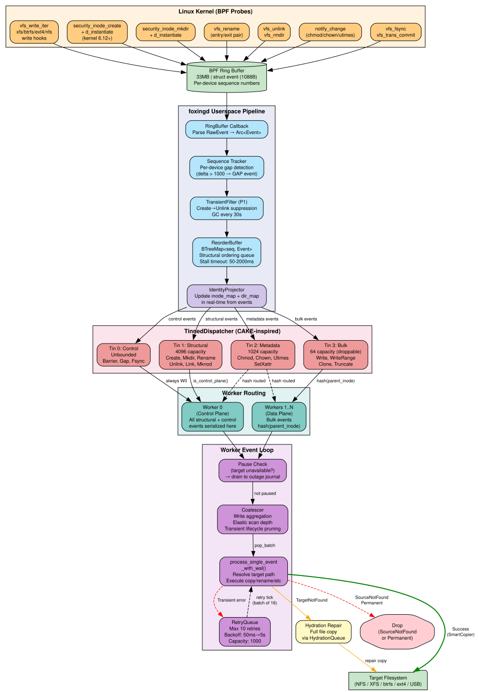

# Foxing: High-Fidelity Filesystem Replication

    [](https://copr.fedorainfracloud.org/coprs/jwp/foxing/package/foxing/) [](https://aenertia.codeberg.page/foxing/)

**Foxing** is a high-performance filesystem replication system with two components:

- **fxcp** — Standalone smart copy tool. Drop-in replacement for `rsync`/`cp` with auto-adaptive CoW/reflink, io_uring, and BLAKE3 Merkle delta detection. No BPF or root required.
- **foxingd** — eBPF-powered replication daemon for continuous, event-driven mirroring with sub-millisecond latency.

## Performance

### fxcp vs rsync vs cp (btrfs-over-LUKS2, NVMe)

| Workload | rsync | cp | fxcp | fxcp vs rsync |
|----------|------:|---:|-----:|--------------:|
| 10K small files (4KB each) | 607ms | 424ms | **607ms** | parity |
| 10 large files (100MB each) | 1236ms | 4ms | **23ms** | **54x faster** |
| Mixed (5K files, 2.1GB) | 3998ms | 239ms | **383ms** | **10x faster** |
| Sparse files (10x50MB) | 764ms | 3ms | **21ms** | **36x faster** |

### NFS 4.2 Performance (XFS NVMe → NFS HDD)

| Workload | rsync | fxcp | fxcp vs rsync |
|----------|------:|-----:|--------------:|
| 5000 tiny files | 12.8s | **11.5s** | **1.11x faster** |
| NFS→NFS 100MB (same server) | 297ms | **82ms** | **3.62x faster** |
| 100MB throughput | 322ms | 386ms | 0.83x (259 MB/s) |

### foxingd Daemon Latency (BPF event-driven)

| Workload | XFS→XFS | XFS→NFS | XFS→tmpfs |
|----------|--------:|--------:|----------:|
| Single file create (4KB) | **17ms** | **19ms** | **16ms** |
| Single file create (64KB) | **16ms** | **18ms** | **17ms** |
| Rename propagation | **15ms** | **21ms** | **16ms** |
| Batch 10×4KB | **187ms** | **209ms** | **190ms** |

fxcp auto-selects the optimal strategy: NFS compound RPC for small files on NFS, reflink (instant CoW) for same-device, sendfile for small files, io_uring for large cross-device transfers. foxingd adds BPF event capture for 15-21ms single-file replication latency.

See [BENCHMARKS.md](BENCHMARKS.md) for comprehensive results including MTTC matrices, tool comparisons, and [visual benchmarks](docs/graphs/).

### v0.7.1 Highlights

- **Snapshot management** — `fxcp snap list/prune/stats/export/import/restore` (dirvish-style point-in-time trees)
- **`.fxar` archive format** — content-addressable BLAKE3 chunk dedup for portable snapshot archives
- **CoW storage stats** — apparent vs on-disk size reporting with reflink savings percentage
- **Selective restore** — extract specific files/dates from archives with glob patterns
- **Full compression matrix** — zstd (default), lz4, gzip, xz for both copy and export
- **`--snapshot` flag** — create reflink snapshots before overwriting during copy
- **`--throttle` flag** — PSI-based system stress pacing

### v0.7.0 Features

- **Multi-source fxcp** — `fxcp src1 src2 src3 dest/` (cp/rsync-compatible positional args)
- **Include/exclude filtering** — `--include`, `--exclude-from FILE`, `--include-from FILE` (rsync-compatible)
- **Hydration stale file cleanup** — foxingd deletes target files not present on source during resync
- **Post-recovery full scan** — NFS reconnect triggers full source walk after journal replay
- **WAL storm detection** — pre-registration rename storm registry suppresses ghost creation during rapid rename chains

### v0.6.0 Features

- **Adaptive dir-hash pruning** — resync skips unchanged directory subtrees (9-11x faster than rsync at 10K files)
- **Adaptive Merkle chunks** — signatures scale with file size (no >130MB cliff)
- **NFS batch_stat prescan** — compound RPCs bulk-fetch target metadata
- **Targeted recovery scan** — O(journal) with dir-hash signature pruning
- **Worker-side mount detection** — 500ms lazy unmount detection (was 10s)
- **ENOSPC Safe Stall** — survives disk pressure without crash

## Quick Start: fxcp (No Root, No BPF)

```bash
# Build (no BPF toolchain needed)
cargo build --release -p fxcp

# Basic copy (like cp -a)
fxcp -a /source /destination

# Multiple sources (like cp/rsync)
fxcp -a /src1 /src2 /src3 /destination/

# With delete (like rsync --delete)
fxcp -a --delete /source /destination

# Include/exclude filtering
fxcp -a --exclude '*.tmp' --include 'important.tmp' /source /destination
fxcp -a --exclude-from patterns.txt /source /destination

# Dry run
fxcp -a -n /source /destination

# Generate foxingd-compatible signatures (for later fast resync)
fxcp -a --generate-sigs /source /destination
```

fxcp detects the storage stack (dm-crypt, btrfs, XFS, containers) and adapts automatically.

### fxcp + foxingd Integration

`fxcp --generate-sigs` writes the same xattr/sidecar signatures that foxingd uses for fast resync. This enables the workflow:

```bash
# 1. Fast initial seed with fxcp (no BPF, no root needed for local)
fxcp -a --generate-sigs /source /target

# 2. Start foxingd — hydration scan sees signatures, skips matched files
foxingd daemon -c config.toml
# Log: "Hydration: 0 files require synchronization"
```

Also enables sneakernet: copy to USB with fxcp, ship it, plug into target host, foxingd recognizes the signatures and only syncs changes since the copy.

## Quick Start: foxingd (eBPF Daemon)

```bash
# Install BPF dependencies (Fedora/RHEL)
sudo dnf install clang llvm libbpf-devel bpftool

# Build
cargo build --release -p foxingd

# Run with TUI
sudo ./target/release/foxingd daemon --config config.toml --tui

# One-shot sync (like rsync)
./target/release/foxingd sync -a /source /destination

# Check status
foxingd status

# View metrics
foxingd metrics
```

## Installation

### Fedora / RHEL (COPR)

```bash
# Enable the COPR repository
sudo dnf copr enable aenertia/foxing

# Install fxcp only (no BPF/root needed)
sudo dnf install fxcp

# Install the daemon (requires kernel 6.12+)
sudo dnf install foxingd

# Enable and start the daemon
sudo systemctl enable --now foxingd
```

### Debian / Ubuntu

`.deb` packages are available — see [Releases](https://codeberg.org/aenertia/foxing/releases).

### From Source

```bash
# fxcp only (no BPF deps needed)
cargo build --release -p fxcp

# foxingd only (requires BPF toolchain)
cargo build --release -p foxingd

# Full workspace
cargo build --release --workspace

# Install (binaries, man pages, shell completions, systemd units)
make install DESTDIR=/usr/local
```

### Requirements

- **Kernel:** Linux 6.12+ (BPF `security_inode_create` + `d_instantiate` fallbacks)
- **Architectures:** x86_64, aarch64
- **Build Tools:** `cargo` (nightly), `clang`, `llvm`, `bpftool`, `libbpf-dev`
- **Target Filesystem:** XFS, btrfs, ext4, F2FS, NFS 4.2 (for reflink/CoW support)

### Shell Completions

Completions are installed automatically with packages. For source builds:

```bash
# Generate and install manually
cargo run -p xtask -- completions
source dist/completions/fxcp.bash    # bash
source dist/completions/foxingd.bash
```

Zsh and fish completions are also generated.

## Workspace Structure

```
foxing/
├── fxcp-core/     Smart copy engine library (io_uring, reflink, Merkle, NFS bypass)
├── fxcp/          Standalone CLI binary (5.6 MB stripped, no BPF)
├── foxingd/       eBPF replication daemon (16 MB stripped, requires libbpf)
├── xtask/         Build tooling (man page + completion generation)
├── dist/          Packaging (RPM spec, deb, systemd units)
├── tests/         Regression harness + adversarial test suite
└── docs/          Architecture, diagrams, configuration reference
```

## Architecture

fxcp-core provides the I/O engine shared by both binaries:

- **SmartCopier**: io_uring async copy with registered buffers
- **Reflink/CoW**: FICLONE ioctl for instant copies on btrfs/XFS/NFS 4.2
- **BLAKE3 Merkle**: Chunk-level delta detection for incremental sync
- **Storage awareness**: dm-crypt, dm-thin, kvdo, Stratis, container detection
- **Governor**: PSI-based system stress management with QoS floor

foxingd adds eBPF event capture, CQRS event ordering, adaptive BBR tuning, mount identity monitoring, and MARS versioning on top.

### foxingd Processing Pipeline



```
Kernel BPF probes → Ring Buffer (33MB) → ReorderBuffer → TransientFilter
  → IdentityProjector → TinnedDispatcher (4-tin CAKE priority queues)
  → Workers (Control Plane W0 + Data Plane W1..N)
  → SmartCopier → Target Filesystem
```

**Pipeline stages:**

1. **BPF Event Capture** — Kernel probes (`vfs_write_iter`, `security_inode_create`, `vfs_rename`, `notify_change`, etc.) capture filesystem events into a 33MB ring buffer with per-device sequence numbers.

2. **Reorder & Filter** — `ReorderBuffer` (BTreeMap) delivers events in sequence order. `TransientFilter` suppresses Create→Unlink chains (temp files). `IdentityProjector` maintains real-time inode→path mapping.

3. **TinnedDispatcher** — CAKE-inspired 4-priority queue (Control/Structural/Metadata/Bulk). Control-plane events (Create, Rename, Mkdir) serialize on Worker 0 for ordering correctness. Bulk writes hash-distribute to data workers. Metadata and bulk events are droppable under pressure.

4. **Worker Processing** — Biased `tokio::select!` loop with adaptive coalescing, exponential backoff retry, and error classification (TargetNotFound→repair, Transient→retry, Permanent→drop).

5. **Mount Monitoring** — Per-target device ID tracking + fsync liveness probes (10s interval). Detects NFS lazy unmount, USB disconnect, remount. Workers pause during outage, events drain to outage journal. Recovery triggers pruning-disabled full scan.

6. **Hydration Pipeline** — Directory Merkle tree pruning for O(dirs) resume. BLAKE3 chunk-level delta copy for >1MB files (<50% dirty threshold). Targeted rescan from outage journal for fast recovery.

See [Architecture Diagrams](docs/ARCHITECTURE.md) for detailed graphviz diagrams of all pathways.

### Auto-Adaptive Copy Strategy

fxcp and foxingd select the optimal copy method automatically:

```
Tier 0.5: NFS compound RPC — userspace OPEN+WRITE+CLOSE in single round-trip (NFSv4.2, ≤16MB)
Tier 1:   FICLONE          — instant CoW clone (btrfs/XFS/NFS 4.2 same-server)
Tier 1.5: copy_file_range  — NFS 4.2 server-side copy (no data over wire)
Tier 2:   sendfile          — kernel-optimized for small files (<64KB)
Tier 3:   io_uring          — async pipelined for large/cross-device files
```

Tier 0.5 (NFS bypass) automatically activates for NFSv4.2 targets with AUTH_SYS. It sends OPEN+WRITE+CLOSE as a single compound RPC over a persistent TCP session, reducing per-file NFS round-trips from 4+ to 1. This makes fxcp faster than rsync for small files on NFS (2.6-2.8x improvement over VFS path).

Sparse files bypass Tiers 1.5 and 2 (both destroy holes) and go directly to Tier 3 with hole-aware I/O.

## Configuration

foxingd uses TOML configuration:

```bash
foxingd --help
foxingd explain  # Prints configuration cheatsheet
```

```toml
# Minimal example
worker_count = 4
queue_max = 200000

[[sources]]
path = "/mnt/data"

  [[sources.targets]]
  path = "/mnt/backup"
  profile = "SSD"            # NVMe, SSD, HDD, Network, NFS, SdCard, Auto
  enable_versioning = true
  max_versions = 5
  max_versions_size_mb = 10240
```

fxcp requires no configuration — it auto-detects everything.

## CLI Usage

### foxingd Commands

```bash
# Start daemon (foreground or systemd)
foxingd daemon --config /etc/foxing.toml

# Start with TUI monitor
foxingd daemon --config /etc/foxing.toml --tui

# One-shot sync (like rsync)
foxingd sync -a /source /destination

# One-shot sync with I/O profile and versioning
foxingd sync -a --snapshot --profile NFS /source /destination

# One-shot sync + watch for changes (daemon mode)
foxingd sync -a --watch /source /destination

# Validate configuration
foxingd check --config /etc/foxing.toml

# Print configuration cheatsheet
foxingd explain

# Check daemon status
foxingd status

# View metrics (text)
foxingd metrics

# Attach TUI monitor to running daemon
foxingd metrics --ui
```

### Versioning Commands (MARS)

If `enable_versioning` is active, the daemon creates zero-cost reflink snapshots on `fsync`:

```bash
# List versions of a specific file
foxingd snapshot list /mnt/backup/database.db

# Revert file to a specific epoch (atomic rollback via Reflink)
foxingd snapshot revert /mnt/backup/database.db 105432

# Extract a past version to a new file
foxingd snapshot copy /mnt/backup/database.db 105432 /tmp/db_restore.db

# Clean up old snapshots (dry run)
foxingd snapshot cleanup /mnt/backup/database.db --dry-run

# Force a tagged snapshot
foxingd snapshot force /mnt/backup/database.db --tag "pre-migration"
```

### fxcp Commands

```bash
# Archive copy (recursive, preserve attributes)
fxcp -a /source /destination

# Multiple sources (last arg is destination)
fxcp -a /src1 /src2 /src3 /destination/
fxcp target/ROCKNIX*.aarch64* /mnt/usb/   # shell glob expansion works

# With delete (like rsync --delete)
fxcp -a --delete /source /destination

# Generate foxingd-compatible signatures for fast resync
fxcp -a --generate-sigs /source /destination

# Exclude patterns
fxcp -a -e '*.tmp' -e '.git' /source /destination

# Include overrides exclude (rsync semantics)
fxcp -a --exclude '*.log' --include 'important.log' /source /destination

# Read patterns from files
fxcp -a --exclude-from excludes.txt --include-from includes.txt /source /destination

# Dry run
fxcp -a -n /source /destination

# Clean orphaned .tmp files and stale dirty flags
fxcp --cleanup /target

# Read from stdin with sparse detection (SIMD zero-block)
tar cf - /data | fxcp - /backup/data.tar

# stdin with CoW checkpoints (periodic reflink snapshots)
fxcp - /backup/stream.bin --checkpoint-interval 300 --checkpoint-keep 5

# stdin with pre-allocated size
fxcp - /backup/disk.img --size 10737418240

# Copy with versioning (reflink snapshots before overwrite)
fxcp -a --snapshot /source /backup

# List snapshots with CoW storage stats
fxcp snap list /backup
fxcp snap stats /backup

# Prune old snapshots
fxcp snap prune --older-than 30d --keep-last 10 /backup

# Export as portable archive (BLAKE3 chunk-dedup)
fxcp snap export /backup -o backup.fxar

# Restore specific file from archive
fxcp snap restore backup.fxar --file 'data/*.db' --latest -o /tmp/
```

See [Snapshots & Export Guide](docs/SNAPSHOTS.md) for comprehensive documentation.

## Capacity Planning

Unlike block-level replication, foxing incurs a per-file metadata cost on the target:

- **Native xattrs** (`user.foxing.*`): Near-zero overhead on XFS, btrfs, ext4 (0 extra inodes)
- **Sidecar fallback** (`.foxing_meta`): 4KB/1-inode per file on filesystems without xattr support

Always provision the target with at least **5% more capacity** than the source to accommodate versioning history and filesystem overhead.

> If the target fills up, the daemon enters a "Safe Stall" — replication pauses without crashing or corrupting existing files. See [Failure Scenarios: Story 5](docs/FAILURE_SCENARIOS.md).

## Safety Mechanisms

1. **Loop Prevention:**
   - **Device Filtering:** eBPF ignores events on the target device
   - **PID Filtering:** eBPF ignores events generated by the daemon's own PID/TGID

2. **Partial Write Protection:**
   - **Atomic Mode:** New files written to `.tmp.uuid` and renamed
   - **Delta Mode:** In-place updates with MARS versioning as crash consistency safety net

3. **Consistency:**
   - `fsync` events trigger global barrier on target
   - Full metadata replication (xattr, ACL, timestamps)
   - Dirty flag sidecar tracking for crash recovery

4. **Mount Monitoring:**
   - Device ID tracking detects target disappearance (USB unplug, NFS unmount)
   - fsync liveness probe catches stale NFS cache from lazy unmount
   - Workers pause during outage, outage journal captures changes
   - Recovery scan runs on reconnect: journal replay + follow-up full scan for unjournaled changes

5. **Hydration Cleanup:**
   - On every daemon restart, full_scan walks the target and deletes files not present on source
   - Ensures eventual consistency regardless of runtime state (ghost files, interrupted copies)
   - WAL storm registry suppresses ghost creation during rapid rename chains

6. **Global Emergency Pruning:**
   - On `ENOSPC`, system deletes oldest version snapshots to free space
   - Live mirror continues after space reclaimed

## Monitoring & Observability

Prometheus metrics served on a **dedicated thread** at `http://localhost:9100/metrics` (responsive even under heavy I/O):

| Metric | Type | Description |
|--------|------|-------------|
| `foxing_events_dropped` | Counter | Events dropped due to full queues (>0 = data gap) |
| `foxing_governor_stressed` | Gauge | 1 if Governor throttling due to system load |
| `foxing_worker_buffer_utilization` | Gauge | Internal buffer usage (>0.8 triggers emergency drain) |
| `foxing_worker_copy_in_flight` | Gauge | Active copy ops per worker (0 = stalled) |
| `foxing_worker_retry_queue_size` | Gauge | Retry queue depth per worker |
| `foxing_events_repair_queued_total` | Counter | ENOENT → repair job dispatched |
| `foxing_events_repair_completed_total` | Counter | Successful repair completions |
| `foxing_copy_timeout_total` | Counter | Copy operations exceeding deadline |
| `foxing_hydration_dir_pruned` | Counter | Directories skipped by Merkle tree pruning |
| `foxing_delta_copy_attempted` | Counter | Delta copy operations (chunk-level) |
| `foxing_delta_bytes_saved` | Counter | Bytes avoided by delta copy |
| `foxing_tuner_state` | Gauge | 0=Steady, 1=Startup, 2=Drain, 3=ProbeBW |

## Testing

```bash
make test-quick    # Fast regression gate (~15s)
make test          # Full suite with human output
make test-json     # JSON output for CI
make test-compare  # Compare against saved baseline
```

### foxingd Adversarial Test Suite (v0.7.0)

10-phase stress test on XFS→NFS (16 vCPU VM → HDD-backed NFS 4.2):

| Phase | Test | Result | Key Metric |
|-------|------|--------|------------|
| 0 | Baseline NFS Throughput | **PASS** | cp=245MB/s rsync=152MB/s |
| 1 | Heavy Hydration (5000 files, 2.7GB) | **PASS** | Converged in ~49s |
| 2 | Live Write Storm (fio 30s) | **PASS** | Back-pressure handling |
| 3 | Rename Chain Storm (100 chains a→e) | FAIL* | 100/100 finals correct, transient ghosts (see below) |
| 4 | NFS Target Drop + Resync (300 files) | FAIL* | Passes independently; fails in suite due to Phase 3 state |
| 5 | Large File Kill/Resume (500MB) | **PASS** | SHA-256 verified after SIGKILL |
| 6 | Disk Pressure (ENOSPC) | SKIP | NFS share too large for safe test |
| 7 | BLAKE3 Delta Copy on Resync | **PASS** | 10 deltas, 20MB saved (97% reduction) |
| 8 | Directory Merkle Pruning | **PASS** | 13 dirs pruned, stale files cleaned |
| 9 | Combined Delta + Pruning | **PASS** | Both optimizations active |

**\*Phase 3 note:** The rename chain storm (500 BPF events in 2.5s) creates a workload density that exceeds NFS copy latency, producing transient ghost files at intermediate rename positions. Three mitigations are in place: WAL storm registry (suppresses CREATE copies during rename chains), post-copy source existence verification, and hydration delete pass (cleans all ghosts on daemon restart). Real-world rename patterns are 1-2 orders of magnitude less dense. Phase 4 passes independently (300/300); it only fails in the full suite because it inherits Phase 3's ghost state without a daemon restart. This is not an intractable issue — ghosts are transient and self-healing.

## Documentation

- **[API Reference (rustdoc)](https://aenertia.codeberg.page/foxing/)** — Live auto-generated API documentation
- [Snapshots & Export](docs/SNAPSHOTS.md) — Point-in-time snapshots, .fxar archives, CoW storage, selective restore
- [Architecture & Diagrams](docs/ARCHITECTURE.md) — Processing pipeline, mount monitoring, error handling (graphviz)
- [Benchmarks & Comparisons](BENCHMARKS.md) — Performance data, MTTC matrices, tool comparisons
- [Queue Marking](docs/Queue-Marking.md) — CoDel/CAKE theory applied to event dispatch
- [Configuration Defaults](docs/CONFIGURATION_DEFAULTS.md) — Default limits and safety behaviors
- [Failure Scenarios](docs/FAILURE_SCENARIOS.md) — Disconnect, crash, ransomware, capacity exhaustion
- [Versioning Simulation](docs/VERSIONING_SIMULATION.md) — Disk space usage under different workloads

## Why the name?

"Foxing" is an archival term for the brownish spots that appear on old paper and antique mirrors — the "rusting" of desilvered glass. Since this project is a **Mirror** written in **Rust**, the name fit perfectly.

It also nods to the classic pangram, "The quick brown fox jumps over the lazy dog." In our case, this represents the core architectural goal: allowing the "Quick Fox" (your fast NVMe source drive) to perform at full speed, completely decoupled from and leaping over the latency of the "Lazy Dog" (your slower backup HDD/Network target).

## License

GPL-2.0-or-later
