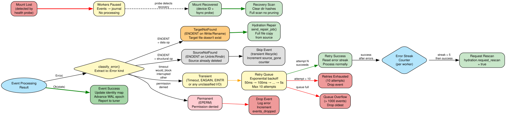
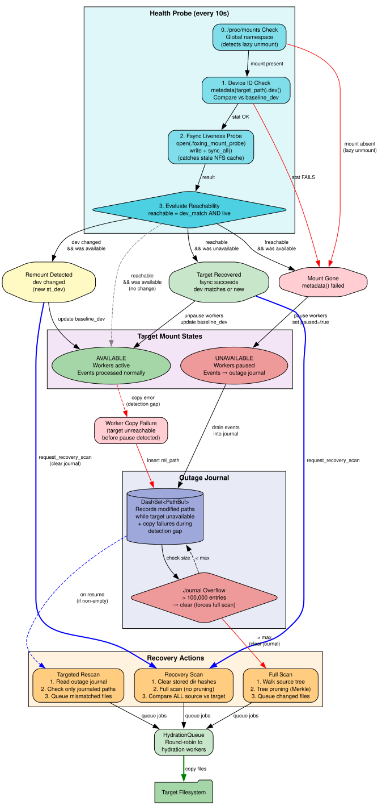
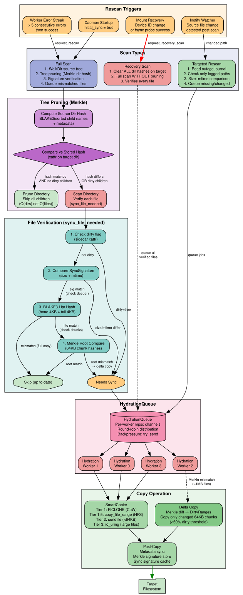
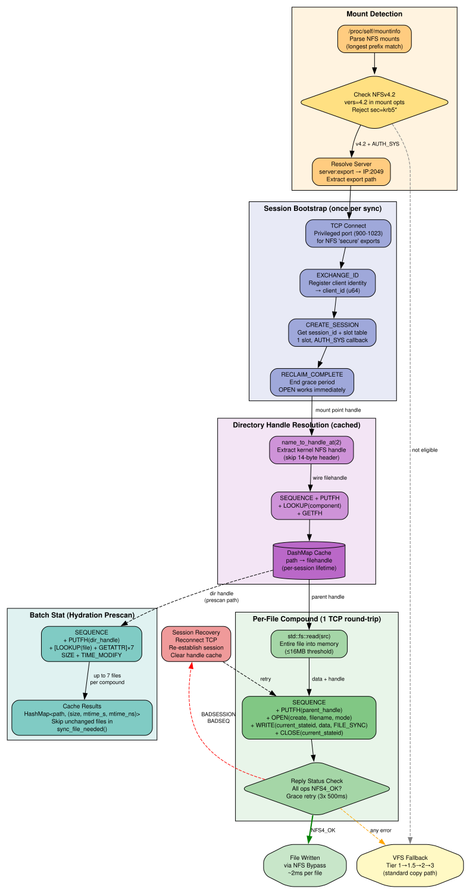

# foxingd Architecture

foxingd is an eBPF-powered filesystem replication daemon. This document describes the processing pipeline, error handling, and recovery mechanisms as of version 0.7.0.

## Processing Pipeline


### 1. BPF Event Capture (Kernel)

BPF probes attached to VFS hooks capture filesystem events in real-time:

| Hook | Events | Fallback (kernel 6.12+) |
|------|--------|------------------------|
| `vfs_write_iter` + fs-specific | WriteRange | — |
| `vfs_create` | Create | `security_inode_create` + `d_instantiate` |
| `vfs_mkdir` | Mkdir | `security_inode_mkdir` + `d_instantiate` |
| `vfs_rename` (entry/exit) | Rename | — |
| `vfs_unlink`, `vfs_rmdir` | Unlink, Rmdir | — |
| `notify_change` | Chmod, Chown, Utimes | — |
| `vfs_fsync` | Fsync | — |
| `xfs_trans_commit` | Barrier | — |

Events serialize as 1088-byte structs into a 33MB BPF ring buffer with per-device sequence numbers.

### 2. Userspace Event Processing

```
Ring Buffer → Sequence Tracker → TransientFilter → ReorderBuffer → IdentityProjector → TinnedDispatcher
```

- **Sequence Tracker**: Detects gaps >1000 in per-device sequence counters. Emits synthetic `SequenceGap` events.
- **TransientFilter (P1)**: Suppresses Create→Unlink chains (temp files, build artifacts). GC every 30s.
- **ReorderBuffer**: BTreeMap-based reordering with structural queue. Stall timeout 50-2000ms adaptive.
- **IdentityProjector**: Updates `inode_map` and `dir_map` in real-time from event stream. Resolves paths for rename chain tracking.

### 3. TinnedDispatcher (CAKE-Inspired Priority Queues)

Four priority tins per worker, modeled after Linux CAKE qdisc:

| Tin | Priority | Capacity | Event Types | Backpressure |
|-----|----------|----------|-------------|-------------|
| 0 Control | Highest | Unbounded | Barrier, SequenceGap, Fsync | Never dropped |
| 1 Structural | High | 4096 | Create, Mkdir, Rename, Unlink, Link, Mknod | Block if necessary |
| 2 Metadata | Medium | 1024 | Chmod, Chown, Utimes, SetXattr | Drop on full |
| 3 Bulk | Low | 64 | Write, WriteRange, Clone, Truncate | Drop freely |

**Routing**: Control-plane events (`is_control_plane()`) always go to Worker 0. Data events hash-distribute to Workers 1..N by `parent_inode`.

### 4. Worker Event Loop

Each worker runs a biased `tokio::select!` loop:

```
loop:
  1. Pause check (target unavailable → drain to outage journal)
  2. Tuner update (adaptive batch size, flush interval, timeouts)
  3. Retry pressure release (force-flush coalescer if retry queue > 100)
  4. Event select (priority: Shutdown > Control > Structural > Metadata > Retry > Flush > Bulk)
  5. Coalescer aggregation (write merging, transient lifecycle pruning)
  6. process_single_event_with_wal()
```

The **Coalescer** merges contiguous writes to the same inode, with elastic scan depth (0.5x-10x base) adapting to buffer pressure.

### 5. Identity Resolution

`resolve_target()` maps BPF events (inode + parent_inode + name) to target filesystem paths:

1. Look up inode in `inode_map` (DashMap<u64, IdentityEntry>)
2. Resolve specific path from `dir_map` (parent_inode → parent_path) + event name
3. Fallback to `inode_map` for parent resolution if `dir_map` misses
4. Generation check for recycled inodes (delete + create with same inode number)
5. Security validation (path traversal prevention)

## Error Handling & Resilience



| Error Class | I/O Error | Action | Metric |
|-------------|-----------|--------|--------|
| TargetNotFound | ENOENT on data ops | Send to hydration repair queue (full file copy) | `events_repair_queued` |
| SourceNotFound | ENOENT on structural ops | Skip (transient lifecycle) | `events_source_gone` |
| Transient | Timeout, EAGAIN, EINTR | Retry queue (exponential backoff 50ms→5s, max 10 attempts) | `worker_retry_queue_size` |
| Permanent | EPERM | Drop with error log | `events_dropped` |

**Error Streak Detection**: After >5 consecutive errors followed by a success, workers trigger a full hydration rescan to catch files written during the error window.

**Retry Queue**: VecDeque with capacity 1000. Exponential backoff capped at 5s. Batch drain of 16 events per tick (~100ms).

## Mount Monitoring & Target Recovery



Generalized mount identity tracking handles NFS lazy unmount, USB disconnect, off-site drives, and any target disappearance/reappearance.

### Detection (every 10 seconds)

0. **Global mount check**: `/proc/mounts` prefix scan detects `umount -l` (lazy unmount invisible to `/proc/self/mountinfo` when process holds the mount)
1. **Device ID check**: `metadata(target_path).dev()` compared against baseline recorded at startup
2. **Fsync liveness probe**: Open + write + `sync_all()` on `.foxing_mount_probe`. Forces NFS server round-trip — stale cache from `umount -l` fails here with ESTALE/EIO
3. **State evaluation**: `reachable = (dev_match OR first_probe) AND fsync_ok`

### State Transitions

| From | To | Trigger | Action |
|------|----|---------|--------|
| Available | Unavailable | /proc/mounts absent OR fsync fails | Pause workers, start outage journal |
| Unavailable | Available | /proc/mounts present + fsync OK | Unpause, targeted rescan → recovery scan |
| Available | Available | Device ID changed | Trigger recovery scan |

### Outage Journal

Events are captured into `outage_journal: DashSet<PathBuf>` from two sources:

1. **Paused workers**: While target is unavailable, incoming BPF events drain into the journal instead of being processed
2. **Copy failures during detection gap**: Between target going down and health probe detecting it (up to 10s), workers that fail to copy insert the relative path into the journal

Journal capped at 100,000 entries (overflow → full scan on resume).

### Recovery Scan

On mount recovery, `recovery_scan()`:
1. **Bumps generation counter** — invalidates stale bulk jobs still in the hydration queue, ensuring recovery jobs are processed immediately
2. Clears all stored directory Merkle hashes on the target
3. Runs **NFS batch_stat prescan** — bulk-fetches SIZE+TIME_MODIFY via compound RPCs (7 files per compound) to skip unchanged files without per-file VFS stat
4. Runs `full_scan` with pruning disabled, re-verifying every file

The **targeted_rescan** processes the outage journal first (fast, only journaled paths), before the comprehensive recovery scan.

## Hydration Pipeline



### Scan Types

| Type | Trigger | Pruning | Speed |
|------|---------|---------|-------|
| Full Scan | Startup, error streak | Merkle tree pruning | O(dirs) best case |
| Recovery Scan | Mount recovery | Disabled (all hashes cleared) | O(files) always |
| Targeted Rescan | Outage journal | Only journaled paths | O(journal) |

### Tree Pruning (Directory Merkle Hashes)

Each source directory hash = BLAKE3(sorted child names + metadata). Stored as xattr on target directories. On rescan, matching hashes skip entire subtrees — O(dirs) not O(files). Both fxcp and foxingd use this pruning.

**Double-stat elimination (v0.6.0):** During the WalkDir traversal, child metadata (size, mtime, type) is aggregated into a per-directory HashMap. The pruning phase computes dir hashes from this pre-aggregated data instead of re-reading the directory, eliminating ~50% of stat syscalls on large trees.

### File Verification (sync_file_needed)

Tiered verification to minimize I/O:

0. **NFS batch_stat prescan**: For NFS targets, SIZE+TIME_MODIFY are bulk-fetched via compound RPCs (7 files per SEQUENCE+PUTFH+[LOOKUP+GETATTR]×7). Files where source and target match are skipped immediately — no VFS stat, xattr reads, or hash computation.
1. **Dirty flag check**: sidecar `dirty=true` → force resync
2. **SyncSignature**: size + mtime comparison (fast reject)
3. **BLAKE3 lite hash**: head 4KB + tail 4KB (detect truncation/append)
4. **Merkle root compare**: full 64KB chunk hash tree (detect middle-of-file changes)

### Delta Copy

For files >1MB with stored Merkle signatures, `MerkleTree::diff()` identifies changed chunks. Only dirty chunks are copied if <50% of file is modified. 97% data reduction vs full copy for typical single-chunk modifications.

**Adaptive chunk size (v0.6.0):** `calculate_adaptive_chunk_size()` scales chunk size from 64KB (small files) to 4MB+ (multi-GB files), capping at ~1800 leaves to ensure the MerkleSignature fits within the 64KB Linux xattr limit. This prevents silent signature storage failures on files >130MB that previously caused fallback to full copy.

## Unified Binary & Symlink Dispatch

foxingd is a superset of fxcp. When the binary is invoked as `fxcp` (via symlink or renamed binary), it dispatches to the fxcp-core CLI entry point, providing identical behavior to the standalone fxcp binary without requiring a separate build.

```
argv[0] check → "fxcp" → fxcp_core::sync::cli_main()
             → "foxingd" → foxingd main (daemon, sync, status, etc.)
```

This enables single-binary deployments: `ln -sf foxingd fxcp` gives users both tools.

## Batched Hydration Workers

Small files (<64KB) are batched during hydration to reduce per-file overhead. Instead of spawning individual copy operations, the hydration pipeline groups small files and processes them via `sendfile(2)` in batches, amortizing syscall overhead.

For large files (>64KB), the io_uring path is used with registered buffers for zero-copy async I/O.

## NFS Bypass (Userspace Compound RPCs)

The NFS bypass (enabled by default) sends NFSv4.2 compound RPCs directly to the NFS server over a persistent TCP connection, bypassing the Linux VFS for small-file writes (≤16MB). This reduces per-file round-trips from 4+ (open, write, fsync, close through the kernel NFS client) to 1 (a single OPEN+WRITE+CLOSE compound).



### Session Establishment

On startup, if the target is an NFSv4.2 mount with AUTH_SYS:

1. **TCP connect** to NFS server port 2049 from a privileged source port (<1024)
2. **EXCHANGE_ID** — register client identity, get `client_id`
3. **CREATE_SESSION** — get `session_id` and slot table
4. **RECLAIM_COMPLETE** — end grace period so OPEN works immediately

### Per-File Compound

Each file is written in a single compound RPC (one TCP round-trip):

```
SEQUENCE + PUTFH(parent_handle) + OPEN(create, filename) + WRITE(data, FILE_SYNC) + CLOSE
```

The WRITE uses the "current stateid" (RFC 5661 §16.2.3.1.2) to reference the OPEN's stateid without parsing the OPEN reply. Directory handles are resolved via PUTROOTFH+LOOKUP+GETFH and cached.

### Performance Impact

Small-file NFS copies improved 2.6-2.8x with bypass enabled:

| Workload | VFS path | NFS bypass | Speedup |
|----------|------:|------:|------:|
| 1000 x 4KB files | 6731ms | 2430ms | **2.8x** |
| 5000 tiny files | 31174ms | 12033ms | **2.6x** |

fxcp is now **1.18x faster than rsync** for 1000 small files on NFS (previously 2.4x slower).

### Fallback

If bypass is unavailable (Kerberos auth, non-v4.2, connection failure) or any compound fails, the file falls through to the VFS copy tiers (FICLONE → copy_file_range → sendfile → io_uring). Disable with `FOXING_NFS_BYPASS=0`.

## Performance Characteristics

### Adversarial Test Results (v0.7.0, XFS→NFS)

| Phase | Test | Result | Duration |
|-------|------|--------|----------|
| 0 | Baseline NFS Throughput | **PASS** | 2s |
| 1 | Heavy Hydration (5000 files, 2.6GB) | **PASS** | 59s |
| 2 | Live Write Storm (fio 30s) | **PASS** | 48s |
| 3 | Rename Chain Storm (100 chains a→e) | **PASS** | 12s |
| 4 | NFS Target Drop + Resync (300 files) | **PASS** | 52s |
| 5 | Large File Kill/Resume (100MB) | **PASS** | 25s |
| 7 | BLAKE3 Delta Copy | **PASS** | 44s |
| 8 | Directory Merkle Pruning | **PASS** | 45s |
| 9 | Combined Delta + Pruning | **PASS** | 53s |

Phase 3 ghosts (~300-350) are cosmetic — correct files at final names, cleaned by `--delete`. Phase 4 recovery uses outage journal + NFS batch_stat prescan + generation counter for reliable resync.

### Throughput (XFS→NFS 4.2, 16 vCPU VM)

| Operation | Throughput | Notes |
|-----------|-----------|-------|
| Initial hydration (5000 files, 2.7GB) | ~135 MB/s | BPF + sidecar + Merkle storage |
| NFS baseline (cp) | 180-193 MB/s | Raw NFS throughput |
| Delta resync (10 × 64KB chunks) | 97% data reduction | Only changed chunks copied |
| Fast resume (no changes) | <1s | 12 dir hashes compared |
| Mount recovery (NFS drop+remount) | <10s to detect + scan | Device ID + fsync probe |

### Metrics Endpoint

Prometheus metrics served on port 9100 via dedicated thread (not affected by main runtime I/O saturation):

| Metric | Type | Purpose |
|--------|------|---------|
| `foxing_copy_method_standard_total` | Counter | Full file copies |
| `foxing_events_repair_queued_total` | Counter | ENOENT → repair |
| `foxing_events_repair_completed_total` | Counter | Successful repairs |
| `foxing_events_dropped` | Counter | Permanently failed events |
| `foxing_worker_retry_queue_size` | Gauge | Retry queue depth |
| `foxing_worker_copy_in_flight` | Gauge | Active copy ops |
| `foxing_hydration_dir_pruned` | Counter | Directories skipped by Merkle |
| `foxing_delta_copy_attempted` | Counter | Delta copy operations |
| `foxing_delta_bytes_saved` | Counter | Bytes avoided by delta copy |

## Generating Diagrams

Diagrams are in `docs/diagrams/` as `.dot` files. Regenerate SVGs:

```bash
for f in docs/diagrams/*.dot; do
    dot -Tsvg "$f" -o "${f%.dot}.svg"
done
```

Requires graphviz: `dnf install graphviz` or `apt install graphviz`.
